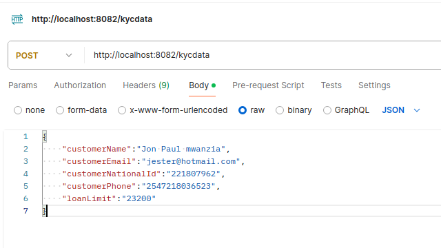

The application deficts the Api for loan processing with the following micro-services.

1. **Kycservice** for mnaging the kyc data for the customers 
2. **loan product micro service** for managing the products 
3. **loan repayment service** for managing repayments - which woul house the necessary jobs for communication to the notification service in
order to notify customers of any repayments that are due, 
4. **Notifications service** - this sends out any notifications to the customers or even internally for any of the events that 
are deemed important and configured for sending out


## Support Services

The following are support services that would be important in the scalable architecture 
1. **Micro Service Discover :** All services are configured to register with the discover service which is 
what is used by all other micro-services in order to be able to locate an instance of any of the service tha they would want to get either data or communications related to loan processing 

2. **Configuration server** : This houses all configuration for the services participating in the loan processing
each of the micro-service has an **application.yaml** configuration file located on the `src\resource` directory with the basic location of the configuration server and the name of the service. 


## Requirements
The applications run on Spring-Boot 3+
2. A working postgres server installation running postgres 11 and above 
2. JDK 21 or above
3.  Maven
4. on your running instance of postgres create the following databases
`create database customerkyc;`
`create database loanproducts;` 
`create database loanrepayments;` 
`create database loanmnagement;`
each of the services will recreate the tables that it requires to run on first time run
5. The product is using ranges of port 8081 - 8090 for purposes of demonstration.

# Running Services

Each of the service requires to be ran manually in the following order 

1. git clone  https://github.com/mwanzias/loanprocessing-ezra.git
2. change directory to the cloned app: `cd loanprocessing-ezra`
2. navigate to the root directory of the ``microserviceConfig-Server`` to start the configurations server `cd microserviceconfig-server && mvn spring-boot:run`  
2. navigate to the root of the microservicediscovery-service and run the service ``mvn spring-boot:run``
3. Navigate to ``cd microserviceconfig-server `` from the root of the project and then run the configurations server ``mvn spring-boot:run``
4. Configure postgres settings:
   For each of the services the configurations are resident on the configuration server(microserviceconfig-server/src/resources/config/*.yaml)
   Each of the service has a file name for its configuration e.g the ```kycservice ``` is named ``kycservice.yaml`` the section that has the database configuration would then be used to configure the database user and password to the one that has been setup for postgres
        edit the section for the username, password and port to the  values that have been setup for your postgresql installation
````   datasource:
   url: jdbc:postgresql://localhost:5432/customerkyc
   username: postgresusername
   password: Postgresspassword
   driver-class-name: org.postgresql.Driver
````
5. Navigate to each of the services directory that is **kycService** and **loanmangement** and run the services and it will register with the discovery services, The other services are  not currently in a running state.
6. Once the discovery service is running navigate to ```http://localhost:8081```   and you can monitor each of the service as it connects to the eureka discovery service.
7. For purposes of the demo everything is configured to run on local host

## port configuration 
The following are things to note, 

1. Ports can be changed for each of the services either on the local application.yaml for the configuration server and the discovery server, while for the other services this can be changed on the configuration server service files.
2. In the event any port changes happen on the service configuration on the configuration server it will then need to be updated on each of the individual application.yaml file for each service in order to be able to locate the configuration server
2. Changing the server on which the discovery service is running on will necesiate updating the configuration of the individual services yaml file
in the configuration server ``**src\resources\config\{servicename}.yaml**``  to update  the port 8081 below to the new discovery server port
``  client:
    service-url:
      defaultZone: http://localhost:8081/eureka/ ``

in order for the service to be able to locate the discover server.

## Communicating to API
The following are the APIS that have so far been completed 
1. creating a KYC record we can invoke this using postman, insomnia, curl as depicted in the below screenshot 
 


send a post request to ```http://localhost:8082/kycdata``` with a json body of the form 

``{
    "customerName":"Jonh musee",
    "customerEmail":"jester@hotmail.com",
    "customerNationalId":"22709962",
    "customerPhone":"25472036523",
    "loanLimit":"23200"
}``

This should currently create an entry of the KYC information with the loan limit for the customer, however with the discovery service the interface will change to enable scalability.

2. creating a loan product
To create a loan product we will need to call this API end point for testing purpoes.
```http://localhost:8084/loanproducts``` with the following data to post the value may change as desired:

``{
    "productName":"daily-flexible",
    "interestType":"Flexible",
    "interestRate":"221807962",
    "lateFeeRate":"254721803652",
    "lateFeeRateCalcType":"Percentage",
    "interestCalcType":"Percentage",
    "lateFeeApplicationGracePeriod":3,
    "loanPeriod":"30",
    "lonPeriodType":"days"
}``

The `lateFeeRateCalcType` and `interestCalcType` can take either Percentage or Lump for lump what it means is that the 
calculation will be for a lump-sum amount and not a percentage of the principal amount.

The ``lonPeriodType`` will be either `days or months` to denote how the interest will be applied, daily or monthly so that the Jobs that are to run and apply the interest on loans they can easily make that determination


4. loan management not fully completed but in the process of implementing the http exchange to communicate to the loan product service in order to be able to issue loans

# TODO
1. Add Service tests for each of the services
2. implement Jobs on the repayment service for loan repayment schedules and communication to the notification service.
2. Add script to auto run them will be added into the repo
2. Add Api gateway service 
3. complete inter service communication with the HttpExchange 
4. Add Jwt token management in order to protect the APIs
5. Change creation of service tables to update and not recreate tables to retain data 
6. Front End implementation for the overall communication to the APIs
